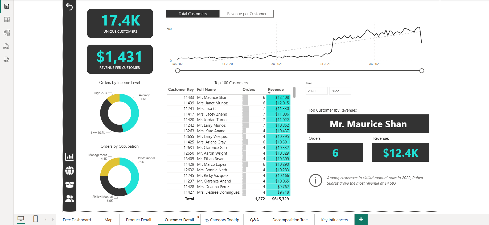

# AdventureWorks Power BI Report 🚴‍♂️📊

An executive-ready Power BI business intelligence solution built on the AdventureWorks dataset, delivering KPI tracking, regional performance analysis, product profitability insights, customer intelligence, AI-driven exploration, and a mobile-first executive experience.

---

## 📌 Project Overview

AdventureWorks is a global manufacturing company producing cycling equipment and accessories.  

As a Business Intelligence Analyst, the goal was to transform raw transactional, product, customer, and sales territory CSV files into an **end-to-end interactive Power BI solution** for executives, management, and stakeholders.

**Key Objectives:**
- Connect, clean, and transform raw data using Power Query  
- Build a relational data model with fact and dimension tables  
- Create calculated columns and measures with advanced DAX  
- Design interactive dashboards with drill-down, slicers, and AI-powered visuals  
- Optimize executive dashboards for mobile-first consumption

This project represents a **full-scale professional BI solution**, emphasizing both analytical depth and executive usability.

---

## 🎯 Executive Dashboard (Page 1)

**Purpose:** Provide stakeholders with a high-level overview of company performance and key business metrics.  

**Key Insights & Visuals:**
- **KPI Cards:** Total Revenue ($24.9M), Total Profit ($10.5M), Total Orders (25.2K), Return Rate (2.2%)  
- **Orders by Category Bar Chart:** Accessories (17.0K), Bikes (13.9K), Clothing (7K)  
- **Top 10 Products Matrix:** Tracks orders, revenue, and return percentage, enabling rapid product performance assessment  
- **Monthly Revenue Trend Line Chart:** Actual vs expected revenue with drill-through tooltips  
- **Most Ordered & Most Returned Product Type:** Tires and Tubes / Shorts  
- Conditional formatting highlights month-over-month KPIs for quick executive consumption

**Screenshot:**  

**Analysis:** This dashboard allows management to quickly gauge overall business health, identify high-performing products, and monitor return trends, facilitating **data-driven decision-making at a glance**.

---

## 🌍 Global Orders Map (Page 2)

**Purpose:** Visualize regional performance and market penetration.

**Key Features & Insights:**
- Microsoft Azure Map with dynamic bubbles by country  
- Region filters: Europe, North America, Pacific  
- Key order counts by country: USA (8,700), Australia (6,060), Canada (3,024), UK (2,771), France (2,315), Germany (2,294)  

**Screenshot:**  

**Analysis:** Geographic insights reveal **market concentration, regional strengths, and expansion opportunities**, helping executives prioritize sales and marketing initiatives regionally.

---

## 🧩 Product Detail Page (Page 3)

**Purpose:** Evaluate individual product performance, profitability, and trends.

**Key Insights & Visuals:**
- Multi-metric gauges showing Orders, Revenue, Profit vs Target with conditional formatting for underperformance  
- Line chart displaying total vs adjusted profit, supporting drill-down by product and category  
- Area chart enabling product metric selection (Orders, Revenue, Profit, Returns, Return %)  
- Narrative summary generated via Power BI AI for deeper, contextual understanding  

**Screenshot:**  

**Analysis:** Provides granular insight into product-level performance, revealing **top revenue drivers, underperforming SKUs, and potential upsell opportunities**.

---

## 👥 Customer Detail Page (Page 4)

**Purpose:** Analyze customer base, segmentation, and revenue contribution.

**Key Insights & Visuals:**
- KPI Cards: Unique Customers (17.4K), Revenue per Customer ($1,431)  
- Drill-down line chart: Customer metrics over time  
- Top 100 Customers Table & Top Customer Card (Mr. Maurice Shan, 6 orders, $12.4K revenue)  
- Donut charts: Orders by Income Level & Occupation  
- Info Box highlights top revenue drivers per customer segment  

**Screenshot:**  

**Analysis:** Enables **targeted customer segmentation, loyalty programs, and personalized marketing strategies**, revealing where high-value revenue is concentrated.

---

## 🛠️ Customer Tooltip (Page 5)

**Purpose:** Dynamic tooltip displaying category-level metrics on hover for executive dashboard interactivity.

**Key Insights & Visuals:**
- Multi-row card: Total Revenue, Profit, Orders, Returns, Return Rate  
- Area chart: Weekly Orders by Start of Week  

**Screenshot:**  

**Analysis:** Enhances executive dashboards with **on-demand, context-sensitive insights**, enabling rapid drill-down into performance without cluttering the main view.

---

## 💬 Q&A Visual (Page 6)

**Purpose:** Natural language querying for quick business insights.

**Key Insights & Visuals:**
- Users can ask questions like “Orders by Month” or “Revenue by Category”  
- Generated line charts display totals dynamically  
- Dynamic matrix tables show orders by category and product color  

**Screenshot:**  

**Analysis:** Supports **ad hoc executive queries**, enabling stakeholders to explore data without advanced technical skills, improving BI adoption and decision speed.

---

## 🌳 Decomposition Tree (Page 7)

**Purpose:** Hierarchical exploration of metrics to identify dominant categories, subcategories, and products.

**Key Insights & Visuals:**
- Interactive decomposition tree for Total Orders (25K)  
- Drill-down example: Accessories → Tires & Tubes → Patch Kit/8 Patches  

**Screenshot:**  

**Analysis:** Reveals **root drivers of performance**, facilitating targeted actions at category and subcategory levels.

---

## 🧠 Key Influencers Visual (Page 8)

**Purpose:** Determine factors that influence key business outcomes.

**Key Insights & Visuals:**
- Homeownership Analysis: Marital Status (M) and Parent Status (Yes) impact likelihood of being a homeowner  
- Top-performing segment: 23% above average in key KPIs  
- Average Retail Price trend visualizes product cost vs retail price  

**Screenshot:**  

**Analysis:** Provides predictive insight into **behavioral and demographic drivers**, enabling strategic planning and targeted campaigns.

---

## 📱 Mobile Layout – Executive Dashboard

**Purpose:** Optimize executive KPIs and visuals for mobile viewing.

**Key Insights & Visuals:**
- KPI Cards for Monthly Revenue and Returns  
- Revenue Trend Line Chart  
- Orders by Category Bar Chart  
- Most Ordered Product Type  

**Screenshot:**  

**Analysis:** Ensures **mobility-ready insights** for executives on the go, supporting timely decisions without desktop dependency.

---

## 🖼️ Full Visuals Gallery

For a complete set of all **34 Power BI report screenshots**, including every report page and tooltip visual, please see the [`visuals/`](visuals/) folder.

---

## 💾 How to View the File

The full interactive analysis is contained in:  
`AdventureWorks_BI_Report.pbix`  

Open in **Power BI Desktop** to explore dashboards, slicers, drill-throughs, and AI-powered insights.

---

## 🛠️ Skills Demonstrated

- Data Cleaning & Transformation with Power Query  
- Relational Data Modeling & Star/Snowflake Schema Design  
- Advanced DAX: Measures, Calculated Columns, Time Intelligence  
- KPI Tracking, Trend Analysis, Conditional Formatting  
- Interactive Power BI Reporting & Dashboard Design  
- Mobile-Optimized Reporting  
- AI & Q&A Visuals for Exploratory Analysis  
- Executive-Ready Data Storytelling & Insight Communication

---

## 🏁 Final Takeaway

This project demonstrates a **full-scale professional Power BI workflow**, from raw data transformation to executive-level insight delivery.  

It showcases the ability to combine **advanced analytics, interactive reporting, mobile optimization, and AI-powered visuals** to inform strategic decisions and enable **data-driven management of a global manufacturing business**.
