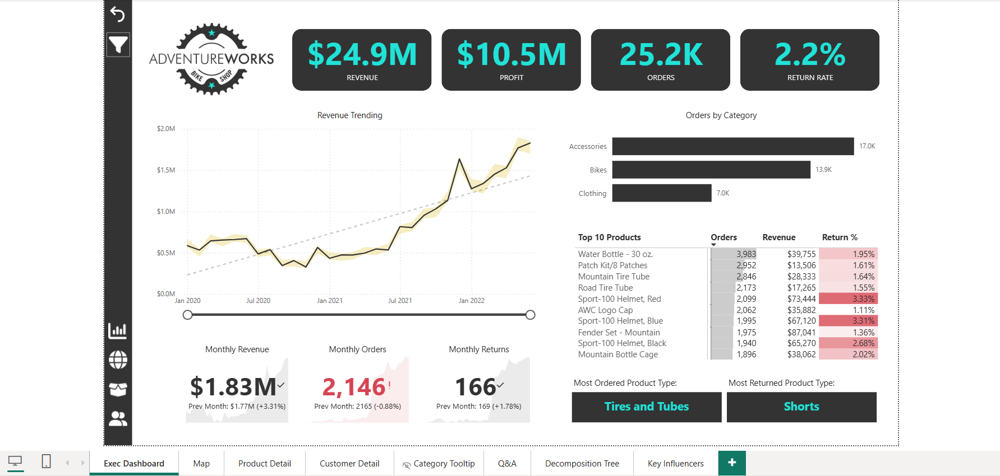
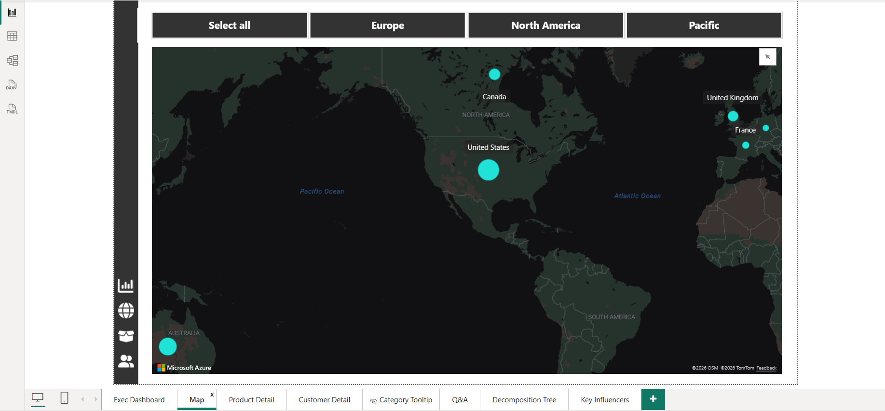
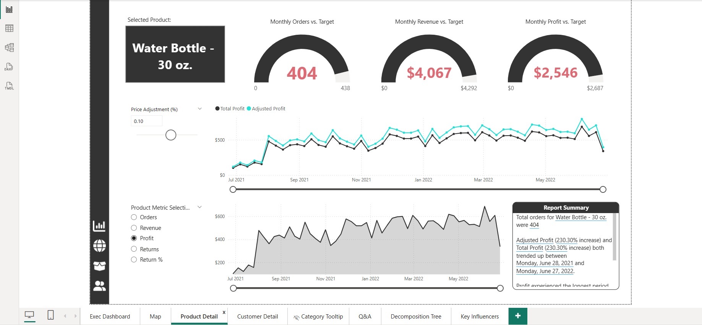
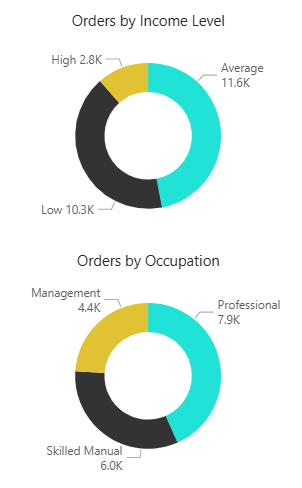
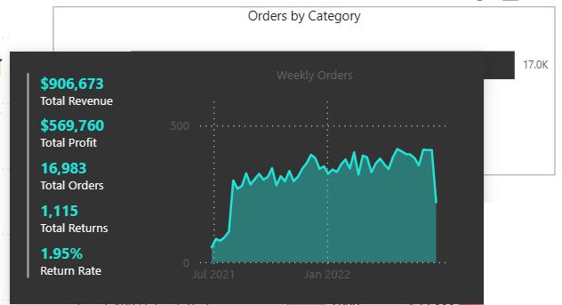
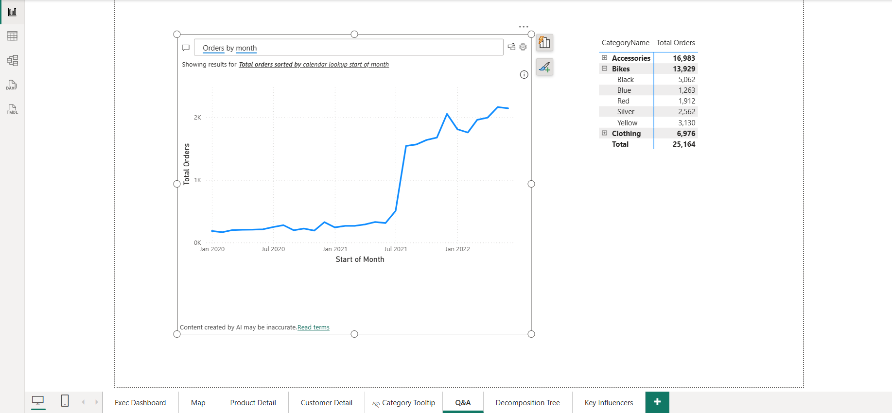
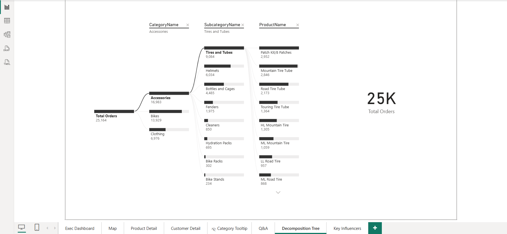
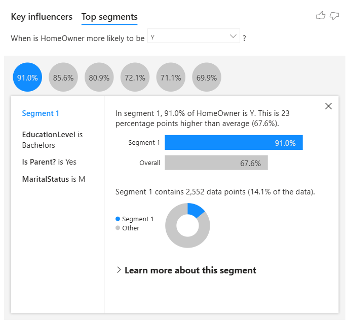
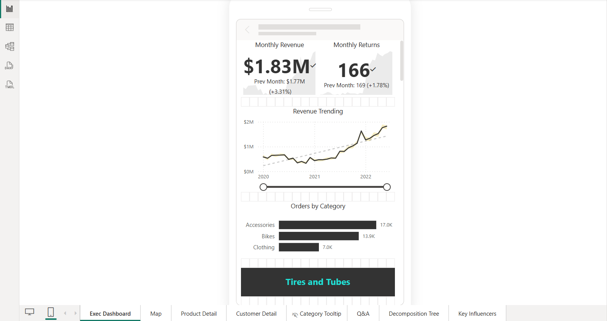

# AdventureWorks Power BI Report 🚴‍♂️📊

An executive-ready Power BI business intelligence solution built on the AdventureWorks dataset, delivering KPI tracking, regional performance analysis, product profitability insights, customer intelligence, AI-driven exploration, and a mobile-first executive experience.

---

## 📌 Project Overview

AdventureWorks is a global manufacturing company producing cycling equipment and accessories.  

As a Business Intelligence Analyst, the goal was to transform raw transactional, product, customer, and sales territory CSV files into an **end-to-end interactive Power BI solution** for management, decision-makers, and stakeholders.

**Objectives included:**
- Connect, clean, and transform raw data using Power Query  
- Build a relational data model with fact and dimension tables  
- Create calculated columns and measures with DAX  
- Design interactive dashboards with drill-down, filters, and AI-powered visuals  
- Optimize the executive dashboard for mobile viewing

---

## 🎯 Executive Dashboard (Page 1)

**Purpose:** High-level overview for stakeholders and executives.  
**Key Visuals:**
- **KPI Cards:** Total Revenue ($24.9M), Total Profit ($10.5M), Total Orders (25.2K), Return Rate (2.2%)  
- **Orders by Category Bar Chart:** Accessories (17.0K), Bikes (13.9K), Clothing (7K)  
- **Top 10 Products Matrix:** Featuring metrics like orders, revenue, and return %  
- **Monthly Revenue Trend Line Chart:** Displays actual vs expected with tooltip details  
- **Most Ordered & Most Returned Product Type:** Tires and Tubes / Shorts  
- Conditional formatting applied for month-over-month KPIs

**Screenshot:**  

---

## 🌍 Global Orders Map (Page 2)

**Purpose:** Visualize regional performance with geographic filters.  
**Key Features:**  
- Microsoft Azure Map with dynamic bubbles by country  
- Region filters: Europe, North America, Pacific  
- Key country order counts: USA (8700), Australia (6060), Canada (3024), UK (2771), France (2315), Germany (2294)  

**Screenshot:**  

---

## 🧩 Product Detail Page (Page 3)

**Purpose:** Analyze individual product performance and profitability.  
**Key Visuals:**  
- Multi-metric gauges for orders, revenue, and profit vs target (conditional formatting for underperformance)  
- Line chart with total vs adjusted profit, drill-down and slicer-enabled  
- Area chart for product metric selection (orders, revenue, profit, returns, return %)  
- Narrative summary (AI-generated insights) for deeper understanding  

**Screenshot:**  

---

## 👥 Customer Detail Page (Page 4)

**Purpose:** Understand customer base and revenue contribution.  
**Key Visuals:**  
- KPI Cards: Unique Customers (17.4K), Revenue per Customer ($1,431)  
- Line chart with drill-down for customer metrics over time  
- Top 100 Customers Table & Top Customer Card (Mr. Maurice Shan, 6 orders, $12.4K revenue)  
- Donut charts: Orders by Income Level & Occupation  
- Info Box: Highlights top revenue drivers per segment  

**Screenshot:**  

---

## 🛠️ Customer Tooltip (Page 5)

**Purpose:** Hidden tooltip providing dynamic category-level metrics on hover.  
**Key Visuals:**  
- Multi-row card: Total Revenue, Profit, Orders, Returns, Return Rate  
- Area chart: Weekly Orders by Start of Week  

**Screenshot:**  

---

## 💬 Q&A Visual (Page 6)

**Purpose:** Enable natural language querying for business insights.  
**Key Visuals:**  
- Users ask questions like “Orders by Month”  
- Generated line chart displays total orders by calendar month  
- Dynamic matrix table shows orders by category and product color  

**Screenshot:**  

---

## 🌳 Decomposition Tree (Page 7)

**Purpose:** Explore metrics hierarchically to identify dominant categories, subcategories, and products.  
**Key Visuals:**  
- Interactive decomposition tree for Total Orders (25K)  
- Drill-down example: Accessories → Tires & Tubes → Patch Kit/8 Patches  

**Screenshot:**  

---

## 🧠 Key Influencers Visual (Page 8)

**Purpose:** Identify drivers for key business outcomes.  
**Key Visuals:**  
- **Homeownership Analysis:** Marital Status (M) and Parent Status (Yes) influence likelihood of being a homeowner  
- **Top Segment Selected:** Highlights segment performing 23% above average  
- **Average Retail Price Trend:** Visualizes relationship between product cost and retail price  

**Screenshot:**  

---

## 📱 Mobile Layout – Executive Dashboard

**Purpose:** Optimized for mobile viewing, focusing on high-priority KPIs.  
**Key Visuals:**  
- Monthly Revenue, Returns KPI Cards  
- Revenue Trend Line Chart  
- Orders by Category Bar Chart  
- Most Ordered Product Type  

**Screenshot:**  

---

## 🖼️ Full Visuals Gallery

For a complete set of all 34 Power BI report screenshots, including every report page and tooltip visual, please see the [`visuals/`](visuals/) folder.

---

## 💾 How to View the File

The analysis lives in `AdventureWorks_BI_Report.pbix`.  
Open in Power BI Desktop to explore the interactive dashboards, slicers, drill-downs, and AI-powered insights.

---

## 🛠️ Skills Demonstrated

- Data Cleaning & Transformation with Power Query  
- Relational Data Modeling & Star/Snowflake Schema Design  
- Advanced DAX: Measures, Calculated Columns, Time Intelligence  
- KPI Tracking, Trend Analysis, Conditional Formatting  
- Interactive Power BI Reporting & Dashboard Design  
- Mobile-Optimized Reporting  
- AI & Q&A Visuals for Exploratory Analysis  

---

## 🚀 Next Steps

This project demonstrates the **full lifecycle of a professional BI solution**. Next steps could include:  
- Adding predictive analytics with Power BI AI  
- Integrating additional data sources for deeper insights  
- Publishing dashboards via Power BI Service with row-level security for stakeholders

---

